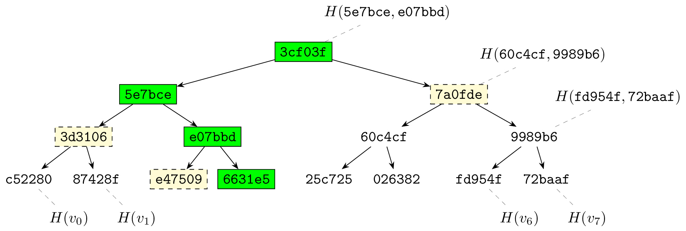

# Background

Here, we briefly overview the main cryptographic primitives ZeroPool is built
with.

## zkSNARK

We use zkSNARKs to enable a smart contract verify conditions on secret
user-supplied data without seeing it.

See [docs for fawkes-crypto library](/docs/fawkes-crypto/background) for a
high-level overview of how zkSNARKs work.

## Merkle Tree

Merkle tree is a mechanism for cryptographically commiting to some values. It
allows efficiently revealing part of the commited values, and recalculating the
commitment when the values change.

Leaves in a Merkle tree contain hashes of the commited values $v_0$ …
$v_{n-1}$. And each inner (that is, non-leaf) node contains the hash of its two
children.

Let's look at the illustration of Merkle tree above (real hash values will be
much longer, this is only an illustration). Suppose you know that the hash of
the root `3cf03f`, but you don't know the whole tree.

 - If I give you a **path** to the green leaf `6631e5` (path being the sequence
   "left, right, right" that leads to that leaf from the root through the
   green nodes), as well as the hashes of all the nodes (highlighted in green
   and light yellow), you can verify that the leaf is indeed holding the
   value `6631e5`. You do that by recalculating the hashes of all the nodes
   along the path and, finally, verifying that the path starts with the
   expected root hash. Note that you needed to see only $O(\log n)$ hash values
   to verify this, and you didn't have to know all $O(n)$ tree nodes for this.

   The path (sequence of left-right turns) to a node in a Merkle tree together
   with the hash values of the nodes encountered on the way is called **Merkle
   proof** for that node. Merkle proof is well-defined for all nodes in the
   tree, not only leaves.

 - If you're holding the root of a Merkle tree (call this "old tree"), and I
   want to change exactly one leaf in it (producing "new tree"), I can show you

   1. the Merkle proof of the leaf in the old tree,
   2. the hash of the new tree's root,
   3. the Merkle proof of the leaf in the new tree;

   using this information you can verify that the proofs are correct, and check
   that the unmodified nodes (yellow on the picture) are the same in both
   proofs (ensuring that exactly one leaf was modified).

   This also works with non-leaf nodes. In this case, the modification replaces
   the subtree rooted in the corresponding inner node.

 - If you encode each "left" turn on the path from root to a leaf as 0, and
   each "right" turn as 1, and compile them into a binary number, that will
   yield the **number** (or **index**) of a leaf (counting left to right).

   For example, the left-most leaf on the illustration above will have path $0,
   0, 0$ and number $000_2 = 0$; its closest neighbor on the right is $001_2 =
   1$ and so on.

The naive way of proving the value of a leaf in Merkle tree discloses location
of that leaf, as well as the hash of the result. The same goes for modifying
a leaf — verifier who is checking the proofs gets to see which leaf was
modified.

With zkSNARKs we can overcome this and perform both operations privately. A
Verifier (for example, a smart-contract) can hold the root of a Merkle tree and
allow users to replace it with a new value, only if the user supplies a zkSNARK
proof that modifications satisfy some criteria (for example, that only one leaf
whose index is within a certain range was modified). We can prove Merkle proofs
within a zkSNARK proof keeping them private and having Verifier store only the
root hash of a (potentially huge) Merkle tree.
