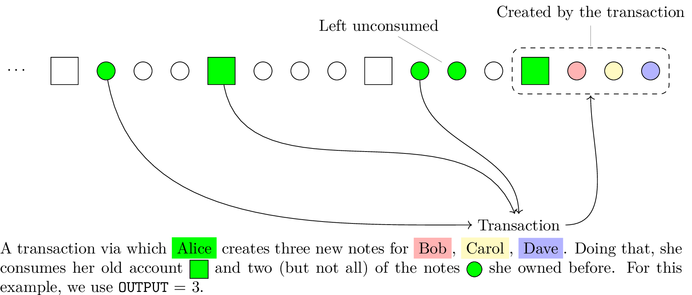

# Transaction

As mentioned in [Overview](overview), ZeroPool encodes all possible actions a
user may want to perform on the pool with a single transaction type. A ZeroPool
transaction consumes one account (associated with user's spending key $\sigma$)
and `INPUT` number of notes that belong to this account. In their place, it
creates a new account (associated with the same spending key $\sigma$ as the
old one) and `OUTPUT` number of new notes. The created new notes may belong to
accounts of other users (with keys different from $\sigma$). Consumed account
and notes can not be used again.

There may exist no more than one account associated with a given spending key
$\sigma$ at any single moment.

:::tip

Since the consumed and newly created account have the same associated
key $\sigma$ and belong to the same user, one can also view them as two
instantiations of the same account, and transaction as modifying this account
(overwriting some fields in it).

:::

## Sequence of Accounts and Notes

ZeroPool organizes all accounts and notes in a long, evergrowing sequence. Each
new transaction appends one account and `OUTPUT` notes to this sequence. We
only append values to the sequence via transactions, and never delete or modify
values that were added before.

Since every transaction creates exactly one account and `OUTPUT` notes, the
sequence will contain them exactly in this order: each $(\texttt{OUTPUT}+1)$-th
element is an account, and everything in-between is notes.

Consider the illustration above. Accounts are drawn as boxes and notes as
circles. We chose `OUTPUT` = 3 here (in practice `OUTPUT` will be much larger),
and the white accounts and notes belong to unspecified users (different from
Alice).

It shows how the sequence of accounts and notes changes when a transaction
happens. In this example, user Alice transfers some tokens to three other
users. Doing so, she consumers her (always unique, identified by her spending
key $\sigma$) account (first green box) and some notes (green circles), and
transfers the tokens held by these to her new account (the second green box)
and three new notes which will belong to the recepient accounts.

The ordering of notes that Alice's transation consumes with respect to her
account is not important, i.e. the consumed notes can be located both to the
left or to the right of the account in the sequence. But with respect to each
other the notes are always consumed in the order in which they appear in the
sequence. If you own notes X, Y, Z that go in this order and you decide to
consume only X and Z, ZeroPool will treat Y as consumed too and forever lock
the tokens it's holding. Alice's account associated with her spending key
$\sigma$ is unique, so there's only one account that can serve as input to the
transaction that Alice performs.

:::info

Since the ordering between accounts and notes is not important for the
transaction, logically, it may be convenient to see this sequence as two
separate sequences merged together, one for accounts and one for notes.

:::

## Embedding Sequence in Merkle Tree

We use Merkle Tree to maintain the state of accounts and notes sequence
