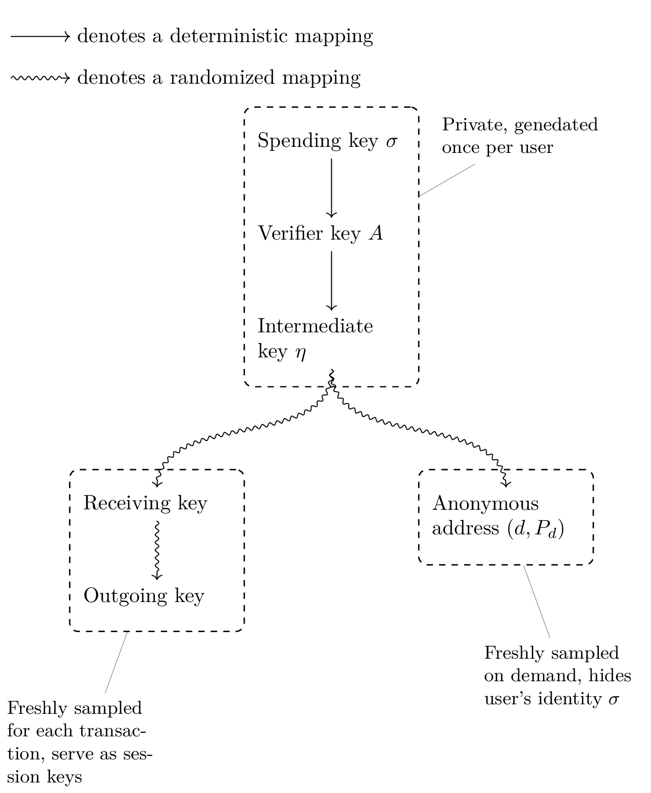

# Transaction

As mentioned in [Overview](overview), ZeroPool encodes all possible actions a
user may want to perform on the pool with a single transaction type. A ZeroPool
transaction consumes one account (associated with user's spending key $\sigma$)
and `INPUT` number of notes that belong to this account. In their place, it
creates a new account (associated with the same spending key $\sigma$ as the
old one) and `OUTPUT` number of new notes. The created new notes may belong to
accounts of other users (with keys different from $\sigma$). Consumed account
and notes can not be used again.

There may exist no more than one account associated with a given spending key
$\sigma$ at any single moment.

:::tip

Since the consumed and newly created account have the same associated
key $\sigma$ and belong to the same user, one can also view them as two
instantiations of the same account, and transaction as modifying this account
(overwriting some fields in it).

:::

## Keys

## Sequence of Accounts and Notes

ZeroPool organizes all accounts and notes in a long, evergrowing sequence. Each
new transaction appends one account and `OUTPUT` notes to this sequence. We
only append values to the sequence via transactions, and never delete or modify
values that were added before.

Since every transaction creates exactly one account and `OUTPUT` notes, the
sequence will contain them exactly in this order: each $(\texttt{OUTPUT}+1)$-th
element is an account, and everything in-between is notes.

Consider the illustration above. Accounts are drawn as boxes and notes as
circles. We chose `OUTPUT` = 3 here (in practice `OUTPUT` will be much larger),
and the white accounts and notes belong to unspecified users (different from
Alice).

It shows how the sequence of accounts and notes changes when a transaction
happens. In this example, user Alice transfers some tokens to three other
users. Doing so, she consumers her (always unique, identified by her spending
key $\sigma$) account (first green box) and some notes (green circles), and
transfers the tokens held by these to her new account (the second green box)
and three new notes which will belong to the recepient accounts.

The ordering of notes that Alice's transation consumes with respect to her
account is not important, i.e. the consumed notes can be located both to the
left or to the right of the account in the sequence. But with respect to each
other, the notes are always consumed in the order in which they appear in the
sequence. If you own notes X, Y, Z that go in this order and you decide to
consume only X and Z, ZeroPool will treat Y as consumed too and forever lock
the tokens it's holding. Alice's account associated with her spending key
$\sigma$ is unique, so there's only one account that can serve as input to the
transaction that Alice performs.

:::info

Since the ordering between accounts and notes is not important for the
transaction, logically, it may be convenient to see this sequence as two
separate sequences merged together, one for accounts and one for notes.

:::

### Account

An Account in ZeroPool is described by four fields:

1. Intermediate key $\eta$ of the account's owner.
2. Spent offset $i$.
3. Balance $b$, the amount of tokens that the account holds.
4. Random salt $t$.

The $\eta$ here binds the account to is owner. Balance $b$ tells how many
tokens the note is holding. And random salt $t$ is there just to make sure
that hash of the account doesn't reveal anything about the fields.

The field $i$ is pointing at some position in the sequence of accounts and
notes. All the notes belonging to this account that are located to the left
of $i$ are considered joined (spent), and the ones in position $i$ and to the
right of it are available for spending.

The picture above illustrates the meaning of spent offset. White accounts
and notes here stand for ones that belong to users other than Alice.

When Alice performs a transaction joining some notes, she will change the
spent offser of her account from old value $i$ to new $i'$. And during that
transaction, she can join the notes that are located between indices $i$ and
$i'$ in the sequence (thus maintaining the invariant). The current position of
Alice's account has no effect on the notes that she can join with that account,
i.e. the joined notes can go either before of after the account (green box on
the picture).

### Note

A Note in ZeroPool is described by the following three fields:

1. $(d, P_d)$, diversified public address this note belongs to.
2. Balance $b$.
3. Random salt $t$.

Balance $b$ and salt $t$ here have the same meaning as in account.

The diversified public address $(d, P_d)$ is binding a note to the account it's
owned by. The values $d$ and $P_d$ are derived from $\eta$, but don't reveal
$\eta$ itself. In order to join a note, the user must provide the value $\eta$
and an account (belonging to $\eta$) to join the note with.

## Merkle Tree Commitment

ZeroPool smart-contract does not store the whole sequence of nodes and
accounts, but instead only holds the (publicly known) commitment to it. We use
Merkle Tree
